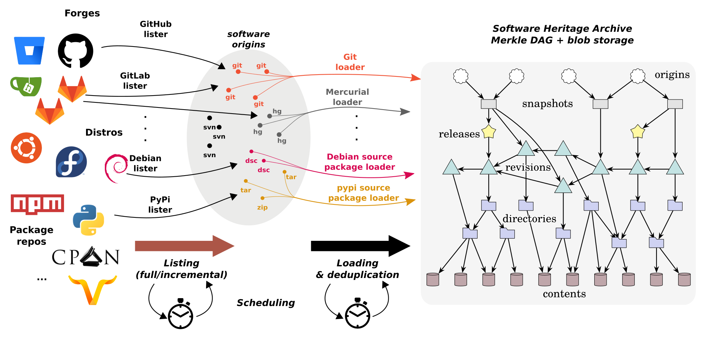

Software Heritage
===========

**Web:** https://www.softwareheritage.org/

**Version control system:** GIT, Subversion, Mercurial 

**Number of projects:** [> 188 mil]

**API:**

* [SoftwareHeritage](https://docs.softwareheritage.org/devel/getting-started/api.html) 

**Open source projects:**

* [Open Source Software](https://archive.softwareheritage.org/)

## Structure
The stated mission of Software Heritage is to collect, preserve and share all software that is publicly available in source code form, with the goal of building a common, shared infrastructure at the service of industry, research, culture and society as a whole.
Software source code is collected by crawling code hosting platforms, like GitHub, GitLab.com or Bitbucket, and package archives, like npm or PyPI, and ingested into a special data structure, a Merkle DAG, that is the core of the archive. 
Each artifact in the archive is associated with an identifier called a SWHID.

The SWH archive is the gateway to all captured source code and its entire development history. With the browsable platform, it is possible to visualize all the visits made to a given location of the code (collected from different forges, package managers and distros) and read the source code content captured.
The Vault is the service in charge of reconstructing parts of the archive as self-contained bundles, that can then be imported locally. For instance in a Git repository. With the vault directories and revisions can be downloaded by users on the web platform or through the API.
The deposit allows a client (a repository, e.g. HAL) to submit software source archives and its associated metadata to the SWH archive. Metadata can be also submitted referencing a repository url (origin) or a SWHID.
The SWH archive harvests source code from different sources and converts all the source code into a single and universal data structure.

**Number of live projects:** plenty

### Issue tracking system

|Name|Existence|Comment|
|---|---|---|
|bug/feature/task/|✅|https://docs.softwareheritage.org/devel/|
|priority/severity|✅|https://docs.softwareheritage.org/devel/swh-scheduler/cli.html#cmdoption-swh-scheduler-task-list-P|
|estimates|✅||https://docs.softwareheritage.org/devel/swh-counters/index.html#swh-counters|
|planned/real deadline|✅|in releases (AKA “tags”)|https://docs.softwareheritage.org/devel/swh-model/data-model.html|
|subtasks/related issues|✅|project page -> the Subtasks tab||
|pairing of commits|✅||
|issue change history including people assignment|❌||
|custom categories/tags|❌|https://www.softwareheritage.org/archive/|The projects are organized into collections such as the SH Archive, the Source Code Collection, and the SH Archive Collection.|
|status configuration/workflow|❌|https://docs.softwareheritage.org/devel/contributing/index.html|
|iterations/phases/milestones/releases|milestones|✅|https://www.softwareheritage.org/roadmap/|development roadmap that outlines the project's milestones and releases|
|roles or other characteristics of people|❌|https://www.softwareheritage.org/people/|

### Version management system

|Name|Existence|Comment|link|
|---|---|---|---|
|git flow|✅|||
|complete branch history|✅|Source Code tab for that project and clicking on the Branches tab|https://archive.softwareheritage.org/browse/origin/git/linux/?branch_sort=descending|
|named tags|✅| in the "Tags" section of the project page|
|statistics on commits and people|✅|using the SoftwareHeritage dashboard|
|metrics on code/commits|Tickets tool -> the Metrics sub-tab||
|merge requests (traceable in history)|✅|project page -> the “Merge Requests” tab|
|code review (traceable in history)|❌||

### Projects

|Name|Existence|Comment|
|---|---|---|
|number of contributors|✅|https://archive.softwareheritage.org/browse/origin/directory/?origin_url=https://git.kernel.org/pub/scm/linux/kernel/git/torvalds/linux.git|
|committers|✅|project page -> ‘Committers’ section|
|code size|❌|you can view the size of a project by viewing the project's repository and viewing the number of lines of code included in the project|
|licenses|✅|by "https://archive.softwareheritage.org/browse/origin/<origin-url>"/licenses/"|
|technologies used|✅|by "https://archive.softwareheritage.org/browse/origin/<origin_url>"/technologies/ "|
|product health from ci/cd pipeline|❌|https://www.softwareheritage.org/resources/|

* https://app.assembla.com/wiki/show/ticketscad/Statistics

### Tools

|Name|Existence|Comment|
|---|---|---|
|wiki|❌||
|mailing list|✅|https://lists.softwareheritage.org/listinfo/swh-discuss|
|ci/cd pipeline|❌||
|release hosting|✅||
|product website|❌||
|forum or Q&A|❌||
|integration with VCS and ITS|❌||

### Metrics

* **Code Lifecycle** - SoftwareHeritage provides a range of tools to measure the code lifecycle, such as the Lifecycle Dashboard, which allows users to visualize the development and evolution of a project’s code over time, and the Lifecycle Analysis Tool, which provides detailed metrics on the development and maintenance of a project
* **Code Quality** - SoftwareHeritage does not provide any specific metrics for measuring code quality of projects
* **Team Dynamics** - SoftwareHeritage provides an extensive set of data, which can be used to analyze the team dynamics of a project.
* **Project Health** - By SoftwareHeritage Quality Dashboard

### Legend

* ✅ - exists
* ❌ - does not exist
* ❔ - not known